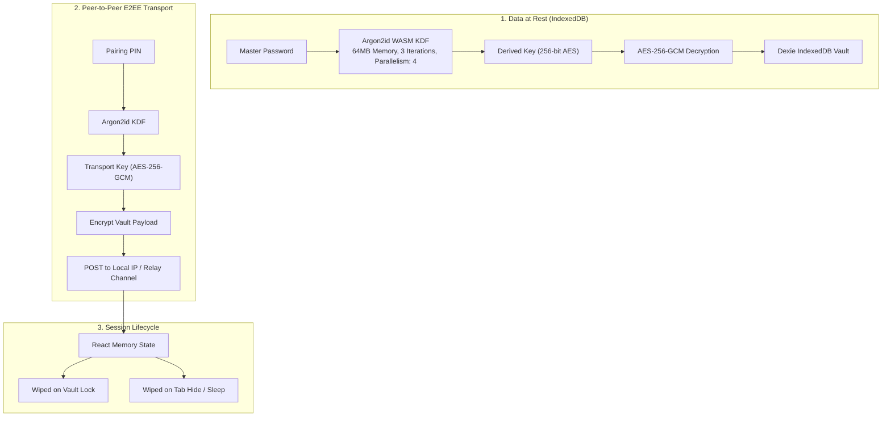
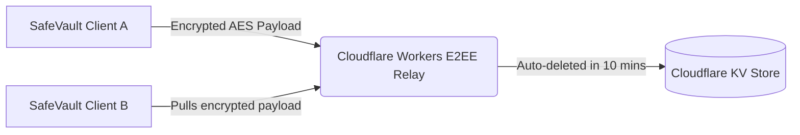

<div align="center">


# 🔐 SafeVault

### Zero-Knowledge, Offline-First Credential Manager

**Your passwords. Your device. Your control. Nothing leaves your machine.**

[](LICENSE)
[](https://pasteurcom6223.github.io)
[](https://pasteurcom6223.github.io)
[](https://pasteurcom6223.github.io)
[](https://pasteurcom6223.github.io)

[Features & Roadmap](docs/features.md) • [Extension Guide](docs/extension_guide.md) • [CLI Guide](docs/cli-guide.md) • [Changelog](docs/CHANGELOG.md) • [Security](docs/SECURITY.md) • [Contributing](docs/CONTRIBUTING.md) • [Installation](#-installation--downloads)

</div>

---

## 📸 App Showcase

Here is how the SafeVault application looks when running on a web browser:

### 🔐 1. Zero-Knowledge Split Landing Screen
On standard web browsers, SafeVault displays a split showcase layout featuring direct, auto-detected OS desktop download options next to the unlock/setup forms.


---

### 📊 2. Main Dashboard & Active TOTP 2FA
The primary dashboard lists all credential cards, categorized items, search utilities, and a secure desktop download card in the sidebar.


---

### ✍️ 3. Add New Credential Form
A clean dialog allows creating logins, cards, and secure notes with optional website URL and TOTP token configurations.


---

### 🔍 4. Credential Detail & Decryption View
Provides click-to-copy fields, hidden password inspection toggles, notes, and live 2FA countdown meters.


---

### ⚙️ 5. Security Settings & Theme Toggles
Features responsive statistics panels, Light/Dark appearance triggers, inactivity auto-lock sliders, and local encrypted backup utilities.


---

### 🔑 6. Password Generator
Allows generating extremely strong cryptographically random strings with specific length and ambiguous character exclusions.


---

## ✨ Key Features

SafeVault is engineered with zero-trust principles. Below is the breakdown of our core capabilities:

### 🔒 Security Hardening
* **Argon2id Key Derivation (OWASP 2026 Standard):** Keys derived securely using memory-hard Argon2id (Memory: 64MB, Iterations: 3, Parallelism: 4) using fast WASM libraries. Automatic background migration seamlessly upgrades legacy PBKDF2 vaults.
* **BIP39 24-Word Recovery Kit:** Enforces generating and validating a 24-word emergency recovery phrase during vault setup.
* **Zero-Knowledge Key Wrapping:** Encrypts the master key with the recovery key using AES-GCM, allowing emergency unwrap/recovery unlocks without credential duplication.
* **Anti-Screen Capture / Screenshot Blocking:** Built-in protection in desktop clients to prevent local malware from grabbing vault data.
* **Clipboard Scrubbing:** Automatically clears copied secrets after 30 seconds.
* **Constant-Time Comparison:** Blocks timing attack probes.

### 📱 Full Feature Set
* **Auto-Discovery Subnet Scanner:** Dynamic parallel subnet scanner check over port `58241` for quick, zero-config peer-to-peer Wi-Fi synchronization.
* **TOTP 2FA Authenticator:** Real-time generation of 6-digit codes with visual countdown meters.
* **Universal CSV Importer:** Directly parse and import credentials from Bitwarden, ProtonPass, Brave, DuckDuckGo, Chrome, and 40+ other formats.
* **Security Health Audit:** Local zero-knowledge scanner checking passwords against leaked breach lists using the k-Anonymity privacy protocol.
* **Interactive CLI Companion:** Global console tool (`safevault`) featuring case-insensitive fuzzy matching and specific property flags (`-u`, `-p`, `-t`).
* **Appearance Customization:** Fully responsive light/dark styling preferences, dynamically saved and persisted.

### 🌐 Privacy & Network Control
* **100% Offline-First:** Runs entirely locally inside your browser's sandboxed storage (IndexedDB via Dexie) or your desktop client.
* **Zero Telemetry or Analytics:** No diagnostic tracking, user metrics, or background pings.
* **No Third-Party CDNs:** Fonts, icons, and libraries are locally bundled in the distribution.

---

## 🛡️ Security Architecture & Privacy Policy

> [!IMPORTANT]
> **Zero-Knowledge Principle:** All cryptographic processes occur locally. Your master password is used solely to derive your local encryption key and is never written to disk or sent across any network.



### 🔬 Deep Cryptographic Specifications & Dependency Choices

SafeVault leverages highly-vetted, production-grade, open-source libraries for all cryptographic operations:
* **Key Derivation (OWASP 2026 Recommended):** **Argon2id** (via [hash-wasm](https://pasteurcom6223.github.io)) with 64MB memory, 3 iterations, and parallelism of 4.
  * *Why hash-wasm?* It compiles native C implementation to WebAssembly, delivering lightning-fast execution in pure sandboxed environments without requiring insecure binary compilation or Node native bindings (crucial for cross-platform portability).
* **Legacy Derivation:** **PBKDF2-SHA512** with 600,000 iterations (silently migrated to Argon2id upon first login).
* **Data Encryption:** **AES-256-GCM** (Galois/Counter Mode) utilizing native Web Crypto API (`crypto.subtle`) with a unique 12-byte cryptographically secure random Initialization Vector (IV) generated for every entry.
  * *Why Web Crypto API?* Being a native browser standard, it executes within privileged browser runtimes, preventing Javascript heap-inspection from scraping keys and mitigating third-party dependency injection attacks.
* **Handshake Signatures:** **SHA-256** signatures verifying timestamp nonces to perform passwordless pairings on Wi-Fi sync.
  * *Why SHA-256?* Extremely light, native, secure algorithm to verify credentials pairing requests without sharing the pairing PIN in plain-text.

---

### 📡 Cloud Relay Architecture: Why We Avoid Proprietary Servers

SafeVault offers a Hybrid-Offline model. If you sync over the internet, a Cloud Relay is used. Here is a direct comparison of why SafeVault migrated from `kvdb.io` to self-hostable Cloudflare Workers:

| Feature | Legacy Relay (`kvdb.io`) | Modern Relay (Cloudflare Workers + KV) |
| :--- | :--- | :--- |
| **Open Source** | ❌ Proprietary (Closed-Source) | ✅ 100% Open-Source (`relay-worker/index.js`) |
| **Data Control** | ❌ Third-party hosted service | ✅ User-controlled / Self-hostable |
| **API Tracking** | ⚠️ Unknown payload logging | ✅ Zero-tracking / Zero-logging |
| **Transport Layer** | ⚠️ Plain HTTP/HTTPS | ✅ Strict CORS + `X-Request-Source` validation |
| **TTL (Time to Live)** | ⚠️ Managed by host configurations | ✅ Hardcoded 10-minute auto-expiry on KV |



---

### 🕵️ Honest Security Audit: What Can Be Leaked or Hacked?

Although the database is strongly encrypted, no system is perfectly secure. Here is a realistic look at potential attack vectors:

1. **Endpoint Compromise (Malware / Keyloggers):**
   * **The Risk:** If your device is infected with malware, a keylogger can capture your master password while you type it.
   * **Mitigation:** SafeVault uses input hardening (`spellCheck={false}`) but cannot prevent kernel-level keyloggers. Keep your host OS clean.
   * **Verdict:** ❌ **VULNERABLE** if host machine is compromised.

2. **Cold Boot Attacks & RAM Dumping:**
   * **The Risk:** While the vault is unlocked, decrypted passwords exist in local memory (RAM). An attacker with physical access or root level malware can dump memory to extract plaintext secrets.
   * **Mitigation:** Lock-on-Sleep, Lock-on-Hide, and clipboard auto-scrubbing reduce the exposure window.
   * **Verdict:** ⚠️ **PARTIALLY PROTECTED** (auto-lock shuts down exposure windows, but key is present in memory while unlocked).

3. **Remote Favicon Fetching (Metadata Leak):**
   * **The Risk:** By default, SafeVault fetches website icons from `icons.duckduckgo.com`. An attacker snooping on your internet traffic can compile a history of hostnames you look up.
   * **Mitigation:** SafeVault provides a **Disable Remote Favicons** toggle. When enabled, all external CDN icon requests are blocked, and logo rendering falls back to local text initials.
   * **Verdict:** ✅ **FULLY RESOLVED** (user can disable this feature entirely).

4. **GitHub Update Pings & PwnedPasswords Queries (IP/Metadata Leak):**
   * **The Risk:** Update checks query `api.github.com`, exposing client usage. Breach checks query `api.pwnedpasswords.com` using k-anonymity (first 5 SHA-1 characters). Although your password is never sent, ISP or intermediate routers can track that your IP is query-scanning breach lists.
   * **Mitigation:** Enable **Strict Offline Mode (Air-Gap)** in Settings to block all outbound update checks, HaveIBeenPwned breach queries, and Cloud Relays.
   * **Verdict:** ✅ **FULLY RESOLVED** (using Strict Offline Mode cuts off all remote connections).

5. **Local Network Sniffing & MITM (Wi-Fi Sync Metadata):**
   * **The Risk:** If syncing devices on an untrusted local network, packet sniffers can intercept the IP addresses and ports active during the sync session.
   * **Mitigation:** SafeVault E2EE encrypts the payloads with Argon2id-derived keys and authenticates using timestamp-hashed nonces, preventing actual credential leaks or man-in-the-middle decryption.
   * **Verdict:** ✅ **E2EE SECURE** (attacker only sees encrypted frames, cannot decrypt without the 6-digit PIN).

6. **DNS Spoofing & Cloud Relay Interception:**
   * **The Risk:** If DNS servers are poisoned, your client might contact a fake Cloud Relay server instead of the Cloudflare Worker.
   * **Mitigation:** Even if the relay server is spoofed, it only receives AES-GCM encrypted data. An attacker cannot decrypt the data without the 6-digit pairing PIN (which is never sent to the server).
   * **Verdict:** ✅ **E2EE SECURE** (data remains zero-knowledge in transit).

---

### ⚠️ Critical Warnings: What NOT to Do (Dangerous Practices)

* **❌ DO NOT Reuse your Master Password:** If your master password is leaked in a public data breach, attackers can easily unlock your local database.
* **❌ DO NOT Lose your 24-Word Recovery Phrase:** SafeVault is zero-knowledge. There is no "Forgot Password" server. If you lose both your master password and recovery phrase, your vault data is **permanently unrecoverable**.
* **❌ DO NOT Sync over Public Wi-Fi without VPN:** Although sync traffic is fully encrypted using Argon2id + AES-GCM and authenticated using timestamp hashes, syncing over untrusted public hotspots exposes your local IP ports to port-scanners.
* **❌ DO NOT Run SafeVault on a Rooted/Jailbroken Phone:** Root access bypasses sandbox permissions (IndexedDB isolation), allowing third-party apps to access your vault files directly.
* **❌ DO NOT Disable Auto-Lock:** Keeping your vault unlocked indefinitely exposes plaintext RAM keys and invites unauthorized physical access (shoulder surfing).
* **❌ DO NOT Leave Decoy/Honeypot Alerts Unattended:** If a honeypot credential copy alert is triggered in your audit log, check for unauthorized access or screen recordings immediately.
* **❌ DO NOT Trust Browser Auto-Fill Extensions Unchecked:** Browser extension overlays can read input values on compromised sites. Keep inputs clean and locked.

---

---

## 🚀 Installation & Downloads

### Official Pre-built Binaries (v1.3.0)

Download the latest release files directly from the [GitHub Releases Page](https://pasteurcom6223.github.io).

#### 🪟 Windows (Windows 10/11)
- **Installer (Recommended):** Download `SafeVault.Setup.1.3.0.exe`. Double-click to install. This automatically registers start menu entries, desktop shortcuts, and links the application icons.
- **Portable Version:** Download `SafeVault.1.3.0.exe`. A single standalone binary that runs instantly without installation (useful for USB drives).

#### 🍎 macOS (Apple Silicon M1/M2/M3)
- **DMG Installer:** Download `SafeVault-1.3.0-arm64.dmg`. Double-click to open, and drag **SafeVault** to your `Applications` folder.
- **ZIP Archive:** Download `SafeVault-1.3.0-arm64-mac.zip`. Unpack and run the application directly.
*Note: If macOS blocks launch with a "Developer cannot be verified" warning, right-click the app, select **Open**, and confirm.*

#### 🐧 Linux (Ubuntu, Debian, Fedora, Arch, etc.)
- **AppImage:** Download `SafeVault-1.3.0.AppImage`. Run the following command in your terminal to make it executable and launch:
  ```bash
  chmod +x SafeVault-1.3.0.AppImage
  ./SafeVault-1.3.0.AppImage
  ```

#### 🤖 Android (Mobile / Tablet)
- **APK Installer:** Download `SafeVault-v1.3.0.apk`. Install it directly on your Android phone or tablet to run SafeVault natively.

### Build from Source

```bash
# Clone the repository
git clone https://pasteurcom6223.github.io
cd SafeVault

# Install dependencies
npm install

# Development mode (web)
npm run dev

# Build for production
npm run build

# Build Electron desktop app (requires electron deps)
npm run electron:build
```

---

## 📖 Usage

### First Launch
1. Launch SafeVault
2. Review the Privacy Policy
3. Create a strong master password (enforced: 8+ chars, mixed case, numbers, symbols)
4. Your vault is ready

### Keyboard Shortcuts

| Shortcut | Action |
|----------|--------|
| `Ctrl+Shift+L` | Lock vault (works even while typing) |
| `Ctrl+N` | New credential |
| `Ctrl+K` | Focus search |
| `Ctrl+G` | Open password generator |
| `/` | Show all shortcuts |
| `Esc` | Close modal / deselect |

### Backup & Restore
- **Export** encrypted backup: Settings → Export Encrypted Backup
- **Import** from backup: Login screen → Import from Backup
- **Auto-backup**: Enable in Settings (saves to localStorage)

---

## 🛠️ Development

### Prerequisites
- Node.js 20+
- npm 10+

### Scripts

```bash
npm run dev          # Start dev server (Vite)
npm run build        # Production build
npm run preview      # Preview production build
npm run test         # Run tests (Vitest)
npm run test:watch   # Tests in watch mode
npm run test:coverage # Coverage report
npm run lint         # Lint code
npm run typecheck    # TypeScript check
```

### Project Structure

```
SafeVault/
├── src/
│   ├── components/       # React UI components
│   ├── hooks/            # Custom hooks (auto-lock, shortcuts, etc.)
│   ├── stores/           # Zustand state management
│   ├── utils/            # Crypto, TOTP, password gen, logger, DB
│   ├── test/             # Test setup
│   ├── App.tsx           # Entry point
│   └── main.tsx          # React mount
├── electron/
│   ├── main.js           # Electron main process (hardened)
│   └── preload.js        # contextBridge secure IPC
├── public/
├── .github/              # GitHub templates & CI/CD
├── electron-builder.json # Electron build config
├── vitest.config.ts      # Test config
└── README.md
```

---

## 🧪 Testing

```bash
npm test
```

Test suites cover:
- ✅ Cryptographic functions (encryption, key derivation, constant-time compare)
- ✅ TOTP generation (RFC 6238 compliance)
- ✅ Password generator (charset selection, entropy)
- ✅ Password policy enforcement
- ✅ Secure logger (sensitive data redaction)

---

## 🤝 Contributing

We welcome contributions! Please see [CONTRIBUTING.md](CONTRIBUTING.md) for guidelines.

### Quick Start
1. Fork the repo
2. Create a feature branch: `git checkout -b feat/amazing-feature`
3. Commit changes: `git commit -m 'feat: add amazing feature'`
4. Push to branch: `git push origin feat/amazing-feature`
5. Open a Pull Request

---

## 📄 License

MIT License - See [LICENSE](LICENSE) for details.

---

## 🙏 Acknowledgments

- [React](https://pasteurcom6223.github.io) - UI framework
- [Vite](https://pasteurcom6223.github.io) - Build tool
- [Tailwind CSS](https://pasteurcom6223.github.io) - Styling
- [Zustand](https://pasteurcom6223.github.io) - State management
- [Dexie](https://pasteurcom6223.github.io) - IndexedDB wrapper
- [Lucide](https://pasteurcom6223.github.io) - Icons
- [Electron](https://pasteurcom6223.github.io) - Desktop framework
- [Capacitor / Ionic](https://pasteurcom6223.github.io) - Mobile app packaging shell

---

## 📞 Support

- 📖 [Documentation](https://pasteurcom6223.github.io)
- 🐛 [Report a bug](https://pasteurcom6223.github.io)
- 💡 [Request a feature](https://pasteurcom6223.github.io)
- 🔒 [Report security issue](docs/SECURITY.md)

---

<div align="center">

**Built with 🔐 by [SudhirDevOps1](https://pasteurcom6223.github.io)**

_Your privacy is not optional. It's the default._

</div>
